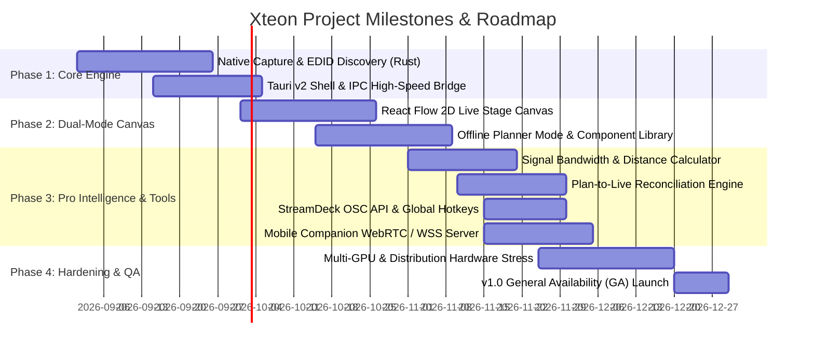

# Project Initiation Document (PID)
# Project Name: Xteon (Extension + Eon)
> **Real-Time Display Topology, Pre-Production Rig Planner & Live Hardware Diagnostics Workspace for Pro AV & Media Production**

---

## Document Information

| Attribute | Details |
| :--- | :--- |
| **Document Version** | 1.2.0 |
| **Project Sponsor** | Xteon Core Engineering & Product Management |
| **Target Platforms** | Windows 10/11 (x64/ARM64), macOS 12+ (Apple Silicon/Intel), Linux (X11/Wayland) |
| **Primary Classification** | Pro AV Infrastructure, Pre-Production CAD & Live Media Utility |
| **Status** | Approved for Implementation |
| **Last Updated** | 2026-08-28 |

---

## 1. Executive Summary & Project Charter

### 1.1 Problem Statement
In professional live production (houses of worship, touring concerts, broadcast control rooms, corporate keynotes, theater, esports arenas), video routing is rarely a simple 1-to-1 cable connection. Media workstations output video into complex distribution hardware:
* **1x4 / 1x8 Distribution Amplifiers (Splitters)** splitting a single GPU feed to multiple confidence monitors.
* **HDBaseT & Fiber Optic Extenders** carrying 4K signals over 100+ meters.
* **SDI Micro Converters & Cross-Converters (Decimators, Blackmagic)** converting HDMI to 3G/12G-SDI for long stage runs.
* **LED Video Wall Processors (NovaStar, Brompton)** mapping custom pixel rasters across dozens of LED cabinets.
* **Matrix Switchers (Blackmagic Videohub, Roland, Kramer, Extron)** dynamically routing inputs to outputs.

Because these screens and processors are located across large venues, AV teams face two massive bottlenecks:
1. **The Pre-Production Planning Void:** Media directors and technical designers currently have no purpose-built tool to plan their video rig, calculate cable bandwidths/distances, and generate patch sheets for stagehands before arriving at the venue. They are forced to use generic diagramming software (Visio, draw.io) or expensive, complex CAD tools (Vectorworks Spotlight) that have no connection to live hardware.
2. **The Show-Day "Blind Output" Dilemma:** At Front of House (FOH), operators cannot see what is physically rendering on stage confidence monitors, teleprompters, or overflow screens, nor do they know if an intermediate splitter or extender has dropped its EDID handshake.

### 1.2 The Xteon Solution
**Xteon** solves both phases of production by unifying **Offline Pre-Production Rig Planning** and **Real-Time Live Hardware Monitoring** into a single software platform:
* **📐 Mode 1: Offline Rig Planner ("Cisco Packet Tracer for Pro AV"):** Drag-and-drop virtual AV component library (sources, splitters, matrixes, extenders, converters, LED processors), smart cable bandwidth/distance calculation, and automated export of **Cable Patch Sheets** and **Equipment Bill of Materials (BOM)**.
* **🔴 Mode 2: Live Monitor & Diagnostics Engine:** Real-time GPU live video previews, 3-tier hardware and distribution discovery, EDID/port introspection, audio VU meters, one-click screen flasher, emergency blackout shields, and an untethered **Mobile Wi-Fi Companion**.
* **✨ The Bridge: Plan-to-Live Reconciliation Engine:** When plugging in at the venue, Xteon automatically matches live physical displays to the pre-production plan, instantly applying custom aliases, stage positions, and routing in a single click.
* **🎛️ Pro AV Hardware Integrations:** Built-in **Bitfocus Companion & StreamDeck (OSC/REST)** support, **Global "Panic" Hotkeys** (`Ctrl+Shift+B`), portable **`.xteon` project files**, **Color-Blind accessible status geometry**, and **zero-dependency native installers**.

---

## 2. Business Value & Return on Investment (ROI)

```
┌────────────────────────────────────────────────────────────────────────────┐
│                             XTEON VALUE PILLARS                            │
├──────────────────────┬──────────────────────┬──────────────────────────────┤
│ 📐 Pre-Production    │ ⚡ Pre-Show Setup    │ 🛡️ Live Show Operation       │
│ Design rigs ahead,   │ Auto-match live rigs │ GPU live previews, audio VU  │
│ validate bandwidth,  │ via "Plan-to-Live",  │ meters, StreamDeck control,  │
│ & export patch sheets│ flash test in 60 sec │ & emergency blackout shields │
└──────────────────────┴──────────────────────┴──────────────────────────────┘
```

### 2.1 Measurable Operational ROI
* **Pre-Production Design Time Cut by 75%:** Eliminates manual drafting in generic CAD tools; automatically calculates cable length and signal bandwidth limits.
* **Pre-Show Line-Check in Under 60 Seconds:** Instant identification of cable connections and auto-matching of pre-planned stage names saves 30+ minutes of physical walking.
* **Zero Audience Mistakes:** Eliminates stage monitor freezes, slide notes leaks, and desktop wallpaper exposures during live services or keynotes via global panic hotkeys and StreamDeck buttons.
* **Crew Communication:** Generates professional PDF Cable Patch Sheets and Equipment BOMs for volunteers, union stagehands, and venue technicians.

---

## 3. Comprehensive Project Scope

### 3.1 In-Scope Deliverables
1. **Dual-Engine Workspace:** Seamless switching between **Offline Planner Mode** and **Live Monitor Mode**.
2. **Virtual Component Library:** Sources, Distribution (Splitters, Matrices), Extenders (HDBaseT, Fiber), Converters (Decimators), LED Processors (NovaStar, Brompton), and Sinks (LED Walls, Projectors, TVs).
3. **Smart Signal & Bandwidth Calculator:** Automatic validation of cable types, maximum transmission distances, and resolution/color depth bandwidth caps.
4. **Plan-to-Live Reconciliation Engine:** Automatic bipartite diff-and-match algorithm mapping live detected EDID/ports to the pre-production plan.
5. **Production Documentation Exporter:** Automated generation of PDF/PNG **Cable Patch Sheets**, **Equipment Bill of Materials (BOM)**, and **Stage Rig Schematics**.
6. **Bitfocus Companion & StreamDeck Support:** Embedded OSC / REST API allowing physical push-button control of Flash, Blackout, Test Patterns, and Presets.
7. **Global "Panic" Hotkeys:** System-wide keyboard shortcut (`Ctrl+Shift+B` / `Cmd+Shift+B`) for instant master blackout across all external screens.
8. **Portable `.xteon` File Format:** Native file association to save, open, and share complete stage topologies and rig plans.
9. **Universal Hardware & Distribution Introspection:** Native OS EDID & Port query, DisplayPort MST parsing, IP matrix discovery, and smart passive splitter injection.
10. **GPU-Accelerated Live Preview Engine:** Low overhead (<1.5% GPU, <50MB RAM) preview streams at 5–15 FPS.
11. **Untethered Mobile Web Companion:** Local HTTPS/WSS server with QR/PIN pairing for iOS and Android devices.
12. **High-Performance SVG Vector System & Accessibility:** Dynamic Level of Detail (LOD) and shape-differentiated color-blind indicators (`●`, `▲`, `🛑`).

---

## 4. High-Level Project Roadmap & Release Schedule



---

## 5. Risk Management Matrix

| Risk ID | Risk Description | Severity | Mitigation Strategy |
| :--- | :--- | :---: | :--- |
| **RSK-01** | **Passive Splitter Invisibility to OS:** Standard passive splitters clone signals without exposing downstream monitors. | High | **Smart Topology Injection**: Users attach virtual splitter nodes that clone the GPU raster into labeled virtual sink cards with synchronized flash tests. |
| **RSK-02** | **GPU Resource Contention:** Video capture loop steals compute/VRAM from live media renderers (Resolume/ProPresenter). | Critical | Low framerate captures (5–10 FPS), GPU zero-copy downscaling, hard cap of <1.5% GPU load. |
| **RSK-03** | **macOS Screen Recording Permissions:** User fails to grant permission under macOS Privacy Settings. | High | Guided onboarding flow with direct deep-links to macOS Privacy Settings. |
| **RSK-04** | **Plan-to-Live Reconciliation Mismatches:** Live connected display count differs from planned rig. | Medium | Visual "Diff & Match" wizard highlighting matched screens in green and offering a manual drag-and-drop resolver. |
| **RSK-05** | **Local Network Security on Mobile Companion / OSC:** Unauthorized access over venue Wi-Fi. | High | Local TLS 1.3 encryption, dynamic 6-digit PIN authentication, and binding OSC/REST APIs strictly to localhost / authorized subnets. |
